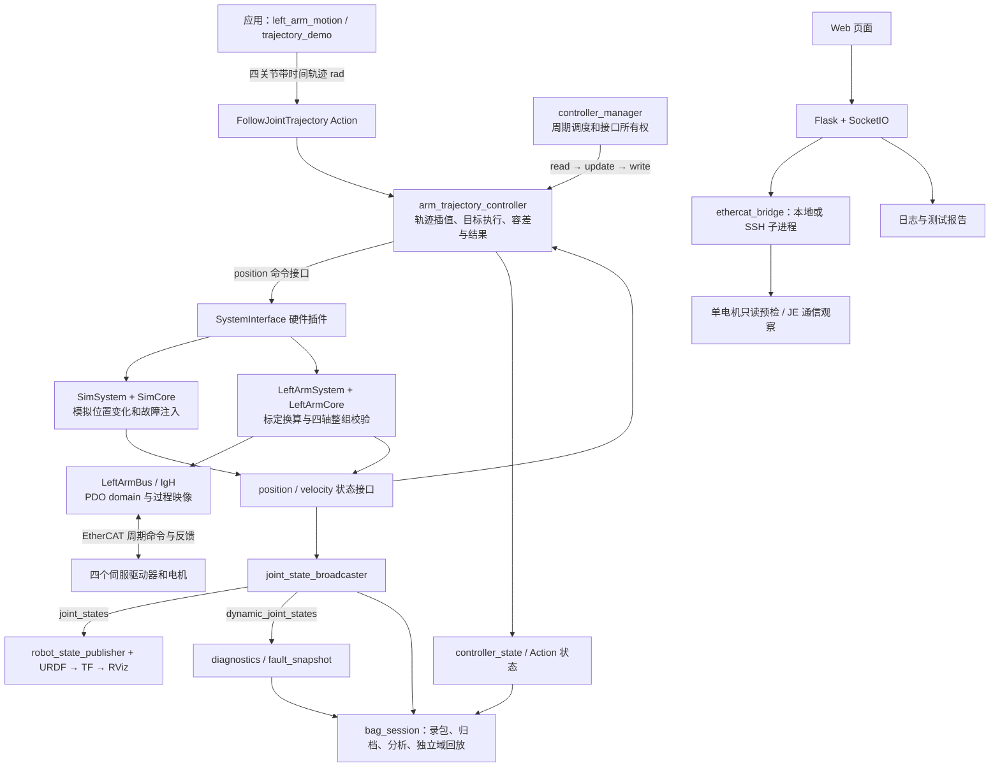
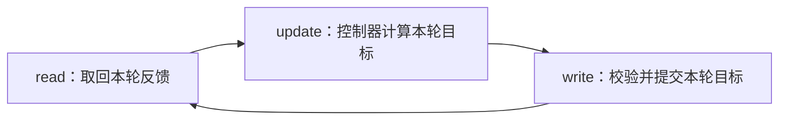

# 项目技术流程与模块职责

依据：2026-10-05 工作目录中的当前源码，重点核对 `control.launch.py`、`controllers.yaml`、`sim_system.cpp`、`left_arm_system.cpp`、`left_arm_core.hpp`、`left_arm_bus.hpp` 和 `app.py`。没有执行硬件动作或新增实机验收。

## 1. 总体结构

本项目围绕四关节左臂 joint_1、joint_2、joint_3、joint_5 建立 ROS 2 标准控制链，物理从站位置对应 p1、p2、p3、p5。另有 Web 测试、单电机预检、CAN/IMU 和报告工具。它们是不同入口，不能理解为“网页经 ROS 必然控制所有硬件”。

图中的两个硬件后端是二选一。controller_manager 调度硬件 read、控制器 update、硬件 write，并不是轨迹控制器自己启动一个总线线程。

## 2. 启动和配置：先把整条链组装起来

`ros2_ws/src/linglong_control/launch/control.launch.py` 是当前核心启动入口，默认 backend=mock。它展开 Xacro，启动 robot_state_publisher、controller_manager、状态广播器、轨迹控制器、诊断节点，以及可选 RViz。广播器 spawner 成功退出后才启动轨迹控制器 spawner；任一 spawner 失败或 manager 退出会关闭整套 launch。

`controllers.yaml` 指定四关节、position 命令、position/velocity 状态和默认 100 Hz 更新目标，即标称 10 ms 一个周期。controller_state 配置发布频率为 50 Hz，Action 监视配置为 20 Hz；这三个频率用途不同，不能混为电机控制频率，也不保证实际每周期准时执行。

物理模式 `ethercat_left_arm` 必须提供 hardware_config，由 `left_arm_configuration.py` 校验设备身份、标定、限位和确认项，再替换硬件描述。未知 backend 会拒绝，物理配置错误不会悄悄退回 mock。

## 3. 应用层：决定要执行什么动作

`left_arm_motion.py` 和 `trajectory_demo.py` 是轨迹客户端，向 `/arm_trajectory_controller/follow_joint_trajectory` 发 Goal。输入是关节名称和多个轨迹点，每个点给出目标位置及相对开始时间；位置用 rad，而不是编码器整数。

例如“2 秒时到达一个小幅目标、4 秒时回到起点”描述的是任务。应用不需要为每一个 10 ms 周期生成 EtherCAT 报文。客户端关注 Goal 是否接受、执行反馈、取消和最终结果。trajectory_demo 用于 mock 验证，不能作为实机动作入口的替代。

## 4. 轨迹控制器：把任务变成每周期目标

`arm_trajectory_controller` 使用 ROS 的 joint_trajectory_controller。它按轨迹时间提供当前时刻的参考位置，结合反馈处理路径与终点容差，并维护 Action 状态。

配置拒绝缺关节的部分目标，四个关节应作为完整目标提交。当前只导出位置命令，没有 effort 命令接口，因此不能据此称为上位机力矩控制。它也没有体现 MoveIt、逆运动学或避障规划；应用提交的已经是关节空间轨迹。

Action 接受表示任务被接收；SUCCEEDED 表示满足控制器结果条件。二者都不能单独证明物理 PDO 成功或机械停机。

## 5. controller_manager：按周期组织控制并管理资源

每周期的逻辑次序是：

read 把模拟或编码器反馈放入状态接口；update 让控制器读取状态、更新轨迹并写命令接口；write 由硬件插件把命令落实到模拟器或总线。随后下一周期再次读取执行结果。

manager 还管理控制器加载、激活、停用与接口占用。项目插件要求四轴整组申请/释放命令接口，防止只接管一部分关节。重新取得接口时把目标对齐当前反馈，避免继续发送旧目标。

这里有两个反馈闭环：ROS 控制层观察轨迹目标与关节反馈；伺服驱动器内部负责实际电机伺服环。当前项目没有展示驱动器内部 PID 参数实现，不能把两层闭环合并成“ROS 直接计算电机电流”。

## 6. SystemInterface：隔离 ROS 和设备实现

`SimSystem`、`LeftArmSystem` 都实现硬件插件接口，导出相同的关节命令和状态，供同一个轨迹控制器使用。插件承担初始化、配置、激活、停用、错误处理、read/write 和接口切换。

模拟后端的 SimCore 使位置按速度约束逐步接近目标，提供位置、速度、周期计数和故障状态，也支持模拟掉反馈与注入故障。它适合验证控制接口、故障逻辑和可视化，但不是包含质量、惯量、摩擦和接触的动力学仿真。

物理后端的 LeftArmSystem 把生命周期和周期接口连接到 LeftArmCore 与 LeftArmBus。配置时建立总线和初始反馈；激活时在有界 startup 流程中检查模式并推进 CiA402 使能；周期 read/write 接收反馈、检查超时并提交命令。生命周期启动流程可以等待，不能据此说周期内也使用 sleep。

## 7. LeftArmCore：把关节单位换成设备单位，并做整组保护

这是不依赖 ROS 或 IgH 的控制核心，便于使用纯逻辑测试验证。主要工作有三项。

第一，标定换算：`编码器目标 = round(zero_counts + 目标rad × counts_per_radian)`；反馈反算为 `位置rad = (原始位置 - zero_counts) / counts_per_radian`；原始速度通过 velocity_scale 换成 rad/s。零点、比例、方向和速度单位必须来自现场标定。

第二，反馈检查：检查完整帧、从站 operational、驱动故障位、机械范围。已激活时，还检查四轴状态字表示 Operation Enabled、模式显示为 CSP=8、跟随误差未超限。

第三，目标检查：有限数、位置范围、int32 可编码、相邻目标步长、按实际周期约束的目标变化速度、目标与实际反馈误差。全部四轴通过后才赋值整组 targets；任一轴失败就锁存故障。速度变化约束并不等于已经具备加速度或 jerk 规划。

## 8. LeftArmBus 和 EtherCAT：真正交换驱动器数据

LeftArmBus 使用 IgH ecrt API 请求主站、创建一个包含四从站的 PDO domain，核对 Vendor ID / Product Code、PDO 对象和位宽，并配置 CSP 模式、看门狗及 DC 参数。

PDO 是运行时周期数据通道，类似事先约定结构的共享数据区。SDO 用于对象字典配置和维护；本插件在初始化用 SDO 配置模式，不在 read/write 中通过 shell 逐轴调用 SDO。

输出包括 0x607A 目标位置、0x6040 控制字；输入包括 0x6064 实际位置、0x606C 实际速度、0x6041 状态字、0x6061 模式显示。控制字是在请求使能/失能，状态字才是驱动实际状态的证据。

接收路径是 receive → domain_process → 检查主站链路、WKC 完整性、各从站状态 → 从过程映像解码反馈。发送路径是写四轴过程映像 → 应用时间/可选时钟同步 → domain_queue → master_send。

WKC 是本周期数据交换完整性的重要指标。EtherCAT AL 的 OP 表示通信工作状态，CiA402 的 Operation Enabled 表示驱动使能状态，两者不是一回事。四轴在同一个过程映像中发送也不自动证明硬件严格同步；DC/Sync0 的参数、时基与实际误差仍需测量验证。

## 9. 反馈、TF 和 RViz：让动作可观察

joint_state_broadcaster 从状态接口发布 `/joint_states` 和 `/dynamic_joint_states`。前者给出关节位置/速度，后者还携带健康及物理总线字段。轨迹控制器同时发布 reference/feedback 状态用于观察误差。

robot_state_publisher 结合 URDF 和 joint_states 计算各连杆之间的 TF；RViz 根据 TF 显示姿态。TF probe 可查询 base_link 到 link_5 的变换。RViz 姿态变化证明模型收到反馈，不能独立证明真实电机转动。当前杆长、轴线和模型范围是示意，几何精度需要真实机械模型。

## 10. 故障路径：在控制路径阻断，观察节点负责解释

锁存意味着下一帧正常也不会自动继续旧轨迹。物理核心的故障穿过 cleanup 仍保留，要求处理原因后重启。故障时状态位置/速度设为 NaN，防止把旧值继续当健康测量。

diagnostics 是独立的只读 Python 观察节点，检查健康字段、反馈年龄和周期是否持续推进，约 5 Hz 发布诊断。fault_snapshot 收集控制器、硬件、目标/反馈和 ROS 通信证据，保存 JSON。它们不承担必须即时执行的底层命令阻断，也不自动复位驱动。

轨迹取消、控制器停用、硬件失能和机械急停的语义不同。当前物理 stop 的 controlword 0 发送是尽力尝试；不能把函数返回或发送请求当作已确认机械停止。

## 11. Web、CAN 和 IMU：调试与测试入口

网页的 templates/static 提供页面和事件交互，app.py 用 Flask 提供页面/API，用 SocketIO 收任务并推送进度、结果。耗时预检或观察任务放到后台，避免阻塞请求处理。

当前有效的主要网页路径为：run_motor_preflight / run_controller_benchmark → ethercat_bridge → 配置选择、本地或 SSH 子进程、Master0 进程内互斥、输出解析与超时/停止 → SocketIO 结果 → comm_logger / report_store / benchmark_store。

单电机预检只读取主控和从站信息，不切 OP、不注册 PDO、不发控制字；预检通过不授予动作许可。默认 JE 程序为通信观察，保持禁用控制字、目标对齐实际位置。独立的 control_benchmark.py 是可写目标的维护工具，不能与默认观察程序混称。

CAN 相关 tester、adapter、can_control、peak_driver_bridge 及串口测试保留了设备测试实现；imu_reader 负责读取并推送姿态。**当前 app.py 的 run_test 和 run_batch 直接返回 legacy_motion_disabled，不能画成仍可从这两个网页事件运行历史动作。** IMU 是配套观测，没有证据表明已接入左臂姿态融合或运动控制。

Web 的进程内 Master0 互斥不等于全系统锁；ROS 插件的主站 reservation 也不阻止所有外部 CLI 维护操作。Web/SSH 不在 ROS 周期控制路径中。

## 12. 录包、归档与验证：留下可重复检查的证据

bag_session 的 record 流程发现控制栈、检查反馈和 TF、启动录包，保存安装配置、实际参数、工具源码、插件哈希、Goal UUID 和日志，再按 bag_profile 分析数据完整性、时间顺序、误差和状态。observe 只观察，wave 明确发 mock 动作。

replay-verify 使用独立 ROS domain，把状态映射到 `/replay/...`，不启动硬件、不重发运动 Goal。它检查每话题数量和有序内容摘要，以证明录制数据回放保真；不证明真实动作再次执行或硬实时性能。

验证应分四层：纯逻辑测试 → 假总线/插件离线测试 → 真实 ROS launch、Action、生命周期与 bag 集成 → 实机 PDO、标定、闭环和停机。前层通过不能替代后层。现有记录有模拟和离线证据，但不足以认定新物理插件已完成生产验收；本次只做源码分析。

## 13. 文档与当前入口的差异

STATE_MACHINE.md 描述了 UNINITIALIZED → READY → ENABLING → ENABLED/RUNNING，以及显式 disable/recover/shutdown 的系统管理流程。system_manager.py、system_state.py 等文件存在，但当前 control.launch.py 没有启动 system_manager，也没有把控制器 spawner 配为文档中的初始 inactive；因此不能直接把该状态机当成默认 launch 的实际流程。

文档所述 mock supervised_fault_stop 和新增硬件阶段字段也未体现在本次读取的 SimSystem 当前实现中；文档所述物理 read/write try_lock，与当前源码使用 lock_guard 不一致。流程图按当前源码解释，文档扩展流程需在部署版本中另行核对。delivery 和 review-fixes 是其他快照/修复资料，不自动等于当前运行源码。

## 14. 一次动作的完整故事

以 mock 小幅四关节动作说明：启动并加载模型/插件/控制器 → 从反馈取得当前姿态 → 应用生成四关节带时间轨迹 → Action 接受 → 每周期 read 获取模拟位置 → 控制器 update 生成这一时刻的参考位置 → write 校验整组命令 → SimCore 按约束推进 → 下一周期反馈变化 → 广播器发布 → TF/RViz 更新 → 控制器判断最终结果 → 录包和报告保存证据。

换成物理后端后，中间的模拟推进被“标定换算、PDO 下发、驱动内部伺服、编码器 PDO 反馈”替换；其余标准 ROS 接口仍可沿用。这是项目采用 SystemInterface 分层的主要价值。
